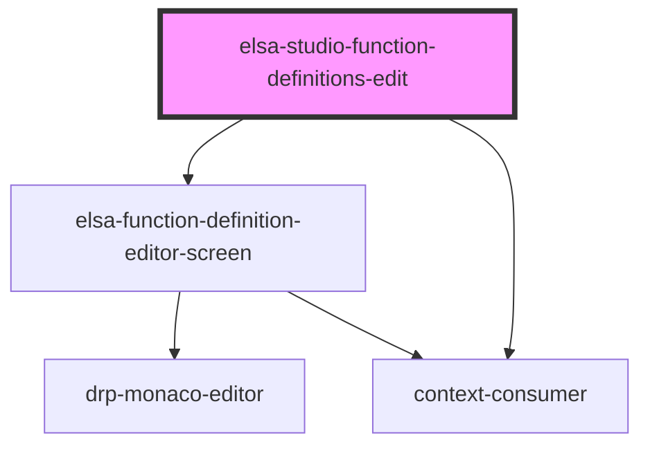

# elsa-studio-workflow-definitions-edit

<!-- Auto Generated Below -->

## Properties

| Property    | Attribute    | Description | Type           | Default     |
| ----------- | ------------ | ----------- | -------------- | ----------- |
| `culture`   | `culture`    |             | `string`       | `undefined` |
| `match`     | --           |             | `MatchResults` | `undefined` |
| `serverUrl` | `server-url` |             | `string`       | `undefined` |

## Dependencies

### Depends on

- [elsa-function-definition-editor-screen](../../../screens/function-definition-editor/elsa-function-definition-editor-screen)
- context-consumer

### Graph

----------------------------------------------

*Built with [StencilJS](https://stenciljs.com/)*
