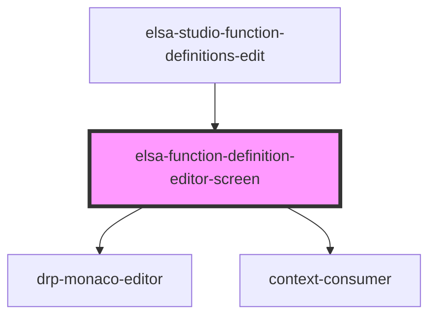

# elsa-workflow-definition-editor

<!-- Auto Generated Below -->

## Properties

| Property               | Attribute                | Description | Type     | Default     |
| ---------------------- | ------------------------ | ----------- | -------- | ----------- |
| `culture`              | `culture`                |             | `string` | `undefined` |
| `functionDefinitionId` | `function-definition-id` |             | `string` | `undefined` |
| `monacoLibPath`        | `monaco-lib-path`        |             | `string` | `undefined` |
| `serverUrl`            | `server-url`             |             | `string` | `undefined` |

## Methods

### `LoadSourceCodeIntoEditor() => Promise<void>`

#### Returns

Type: `Promise<void>`

### `OnCompileFunctionClick(e: any) => Promise<void>`

#### Returns

Type: `Promise<void>`

### `OnFormatFunctionClick(e: any) => Promise<void>`

#### Returns

Type: `Promise<void>`

### `OnRunFunctionClick(e: any) => Promise<void>`

#### Returns

Type: `Promise<void>`

### `OnSaveFunctionClick(e: any) => Promise<void>`

#### Returns

Type: `Promise<void>`

### `compileFunction(requestData: any) => Promise<any>`

#### Returns

Type: `Promise<any>`

### `formatFunction(requestData: any) => Promise<any>`

#### Returns

Type: `Promise<any>`

### `getDetailFunction() => Promise<any>`

#### Returns

Type: `Promise<any>`

### `getFunctionTemplate() => Promise<any>`

#### Returns

Type: `Promise<any>`

### `handleFunctionTypeSelectChange(event: any) => Promise<void>`

#### Returns

Type: `Promise<void>`

### `onMainMonacoValueChanged(e: DrpMonacoValueChangedArgs) => Promise<void>`

#### Returns

Type: `Promise<void>`

### `onOutputMonacoValueChanged(e: DrpMonacoValueChangedArgs) => Promise<void>`

#### Returns

Type: `Promise<void>`

### `onSampleInputMonacoValueChanged(e: DrpMonacoValueChangedArgs) => Promise<void>`

#### Returns

Type: `Promise<void>`

### `runFunction(requestData: any) => Promise<any>`

#### Returns

Type: `Promise<any>`

### `saveFunction(requestData: any) => Promise<any>`

#### Returns

Type: `Promise<any>`

## Dependencies

### Used by

 - [elsa-studio-function-definitions-edit](../../../dashboard/pages/elsa-studio-function-definitions-edit)

### Depends on

- [drp-monaco-editor](.)
- context-consumer

### Graph

----------------------------------------------

*Built with [StencilJS](https://stenciljs.com/)*
